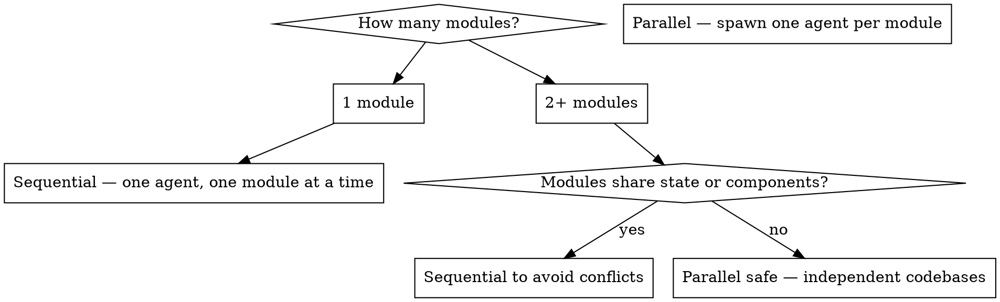

# Next.js to Nuxt Migration

## Overview

Work module by module. For each module handed to you: analyse the full flow first, verify the backend, create a task plan, then build. Never translate blindly — understand what the module does end-to-end before writing a single line of Vue code.

**Core principle:** Understand → Map → Plan → Build. In that order. Every time.

## The Iron Law

```
NEVER WRITE CODE BEFORE YOU HAVE:
  1. A submodule analysis (what it does, full data flow, all UI actions)
  2. A backend verification (which endpoints exist, which are missing)
  3. A written task plan (ordered list of what to build/fix)

NEVER DECLARE A MODULE DONE WITHOUT RUNNING THE FEATURE CHECKLIST AGAINST THE SOURCE.
```

## The Root Cause of Incomplete Ports

Claude translates what is **visible** in JSX — the template structure. It routinely misses:

- Business logic buried inside custom hooks (`useRecipients`, `useChatContext`)
- Keyboard shortcuts and `onKeyDown` handlers
- Conditional rendering paths for empty state, error state, loading state
- `useEffect` side effects (scroll restoration, focus management, analytics)
- Permission/role-based branches (`if (user.role === 'admin')`)
- Responsive behavior (`useMediaQuery`, mobile-specific logic)
- Optimistic UI updates and rollback logic
- Debounced/throttled handlers
- Form validation rules (especially cross-field rules)
- URL query param sync (`?page=2&search=foo`)
- Clipboard, drag-drop, file upload behaviors
- WebSocket/real-time subscriptions inside hooks
- `ref` forwarding and imperative handles
- Context value shape (partial consumption — only reading 2 of 10 context values)

**These are invisible in the template. You MUST read every hook and every handler — not just the JSX.**

## When to Use

- Porting a Next.js/React app to Nuxt/Vue 3
- Converting PM-built React prototypes (mock/JSON-backed) to production Vue apps
- Building NestJS backend endpoints to replace Next.js API routes
- Converting React Context state to Pinia stores

## When NOT to Use

- Migrating between different Vue versions (use `refactoring-safely`)
- Adding features to an existing Nuxt app (use `full-stack-api-integration`)
- Auditing the migrated code after porting (use `codebase-conformity`)

## Multi-Agent Strategy

Choose before starting. Do not change strategy mid-migration.



### Sequential (default — one module handed at a time)

```
User hands off module → Agent runs Phase -1 through Pass 3 → Reports done → User hands next
```

Use when:
- Modules share Pinia stores, composables, or service files
- Backend endpoints overlap (same controller)
- You want to review each module before the next starts

### Parallel (agent team — `agent-team-coordination`)

Spawn one agent per module. Each agent receives:

```
Agent brief per module:
- Module name: {module}          ← the user will provide this (e.g. recipients, campaigns, vishing)
- Source path: {react-repo}/     ← Next.js PM prototype repo the user will provide
- Target path: {nuxt-repo}/      ← Production Nuxt frontend repo the user will provide
- Backend path: {nestjs-repo}/   ← NestJS backend repo the user will provide
- Task: Run Phase -1 analysis only. Produce submodule analysis report + task plan. Do NOT write code yet.
- Constraint: Read-only during analysis. Report back before writing anything.

Example (recipients module):
- Module name: recipients
- Source path: C:/path/to/vishing-simulation-platform/
- Target path: C:/path/to/admin.humanfirewall.ai/
- Backend path: C:/path/to/admin-backend.humanfirewall.ai/
```

**When the user gives you a module name and repo paths, substitute them everywhere in this skill.** The skill uses `{module}`, `{react-repo}`, `{nuxt-repo}`, `{nestjs-repo}` as placeholders throughout.

**REQUIRED:** Analysis-only pass first. Orchestrator reviews all plans before any agent writes code. This prevents agents from creating conflicting service files or duplicate Pinia stores.

**NEVER** let parallel agents write backend code simultaneously — NestJS module registration and Prisma schema changes conflict.

## The Iron Questions (ASK BEFORE STARTING)

```
STOP. Before translating anything, answer these:

1. Does the existing Nuxt codebase already have this feature/page? (check pages/, components/, services/)
2. What Pinia store manages state for this domain? (check store/ and stores/)
3. Does the backend (NestJS) already have endpoints for this data?
4. Which Axios service file owns this domain? (check services/api/)
5. What layout does this page use? (shadcn.vue, auth.vue, admin.vue, portal.vue)
6. What permissions does this page require? (definePageMeta permission)
7. Are there existing composables for this behavior? (check composables/)
8. Which shadcn-vue component maps to the source React component? (check ~/components/ui/shadcn/ — don't create new ones)
```

If you cannot answer these from reading the codebase, READ the codebase before translating.

## Phase -1: Submodule Analysis (START HERE — EVERY MODULE)

When handed a module (e.g. "recipients", "campaigns", "vishing"), do this before anything else.

### Step 1: Understand What the Module Does

```
READ every file in the source module:
  - pages/          → what routes exist?
  - components/     → what UI pieces compose it?
  - hooks/          → what logic is encapsulated?
  - lib/data/       → what JSON operations does it do?
  - app/api/        → what backend routes does it call?

Produce a one-paragraph plain-English summary:
"This module allows users to [primary action]. It lists [data],
lets users [create/edit/delete], filters by [fields], and [special behavior].
Data comes from [source]. State is managed by [mechanism]."
```

### Step 2: Map the Full Data Flow

For every data entity in the module, trace it end-to-end:

```
| Entity | React Source | API Call | NestJS Endpoint | Prisma Model | Nuxt Target |
|--------|-------------|----------|-----------------|--------------|-------------|
| {Module} list | lib/data/{module}.ts readAll() | GET /api/{module} | GET /v1/{module} | {Model} | services/api/{module}.service.ts get{Module}s() |
| Create {module} | lib/data/{module}.ts create() | POST /api/{module} | POST /v1/{module} | {Model} | services/api/{module}.service.ts create{Module}() |
| Bulk delete | lib/data/{module}.ts bulkDelete() | POST /api/{module}/bulk | POST /v1/{module}/bulk-delete | {Model} | services/api/{module}.service.ts bulkDelete{Module}s() |

// Example (recipients):
// | Recipient list | lib/data/recipients.ts readAll() | GET /api/recipients | GET /v1/recipients | Recipient | services/api/recipients.service.ts getRecipients() |
```

### Step 3: Inventory All UI Actions

```
READ every interactive element in every component of the module.
For each one, document:

| UI Action | Trigger | What it does | State changes | API call | Missing in Nuxt? |
|-----------|---------|-------------|---------------|----------|-----------------|
| Search | type in search box | filters table | searchQuery ref | debounced GET ?search= | ? |
| Select page rows | header checkbox | selects visible rows | selectedRows Set | none | ? |
| Select ALL records | "Select all N" banner | sets selectAll flag | selectAllFlag bool | none — sent with mutation | ? |
| Bulk delete | "Delete selected" button | opens confirm modal | deleteModal open | POST /bulk-delete | ? |
| Export CSV | export button | downloads file | loading state | GET /export | ? |
| Column sort | click column header | re-sorts | sortField, sortDir | GET with sort params | ? |
| Filter by status | status dropdown | filters results | filters ref | GET with status param | ? |
| **Row action: Edit** | row "..." menu → Edit | opens edit modal/page | activeRow ref | GET /:id then PUT /:id | ? |
| **Row action: Delete** | row "..." menu → Delete | opens confirm modal | deleteTarget ref | DELETE /:id | ? |
| **Row action: Duplicate** | row "..." menu → Clone | creates copy | loading state | POST /clone/:id | ? |
| **Row action: View** | row "..." menu → View / row click | opens detail sheet | detailRow ref | GET /:id | ? |
| **Row action: Toggle status** | row "..." menu → Enable/Disable | toggles status inline | row.status | PATCH /:id/status | ? |
| Pagination | page buttons / page size | changes page | page, pageSize | GET with page params | ? |
| Empty state CTA | "Add first X" button | opens create flow | createModal open | none | ? |
| Form submit | submit button | creates/updates record | loading, errors | POST or PUT | ? |
| Form validation | on blur / on submit | shows field errors | errors ref | none | ? |
| Modal close | X button / backdrop | closes modal | modal open = false | none | ? |
```

**Row-level action menus are almost always missing.** Every table has a `...` dropdown per row — read the source's `columns` definition or `DropdownMenu` inside the row renderer to find every action. Do not skip this.

Fill the "Missing in Nuxt?" column by checking the existing Nuxt component.

### Step 3b: JSON → Server-Side Behavior Translation

The React/JSON version loads ALL data into memory. The backend has limits. Every "unlimited" React behavior needs a server-side equivalent.

**Map every assumption:**

| React/JSON Behavior | Why it worked | Server-Side Translation |
|---------------------|--------------|------------------------|
| `readAll()` returns every record | JSON file in memory | Paginated API — default page size, never load all |
| `filter(r => r.status === x)` client-side | All data loaded | `GET /v1/recipients?status=x` server filter |
| `sort(...)` client-side | All data loaded | `GET /v1/recipients?sortBy=email&order=asc` |
| "Select all" → `items.map(i => i.id)` | All IDs in memory | Two-stage: select page rows + "select all N records" flag |
| Instant search as you type | Filter in-memory | Debounced search (300ms) → server query |
| Count total from `array.length` | All records loaded | Backend returns `{ data: [], total: N }` — use `total` |
| CSV export from local array | All data in JS | Backend export endpoint streams the file |
| Bulk action on all matching | Filter in memory | Send filter params to backend, backend applies to all |

**The "Select All" Pattern — implement exactly this:**

```
Problem: React shows "select all 3 rows on this page" via checkbox.
         Backend has 500 records across 50 pages.

Solution: Two-level selection UI

Level 1 — Select page rows (default checkbox behavior):
  selectedIds = Set of IDs visible on current page

Level 2 — "Select all N records" banner (appears when all page rows selected):
  "All 20 rows on this page are selected. Select all 500 recipients?"
  → sets selectAll = true (a boolean flag, not an ID list)
  → bulk actions send { selectAll: true, filters: currentFilters } to backend
  → backend applies action to all matching records server-side

Never try to load all IDs to the frontend for "select all".
```

**Pagination — always server-side:**

```typescript
// Nuxt composable pattern
const page = ref(1)
const pageSize = ref(20)
const total = ref(0)
const items = ref([])

const fetch = async () => {
  const res = await getRecipients({ page: page.value, pageSize: pageSize.value, ...filters })
  items.value = res.data
  total.value = res.total  // always from backend
}

watch([page, pageSize, filters], fetch, { immediate: true })
```

### Step 4: Backend Verification

```
For every API call identified above:

| Endpoint | Exists in NestJS? | Controller File | Notes |
|----------|------------------|-----------------|-------|
| GET /v1/recipients | ✅ YES | recipients.controller.ts | Has pagination? |
| POST /v1/recipients | ✅ YES | recipients.controller.ts | — |
| POST /v1/recipients/bulk-delete | ❌ NO | — | Must create |
| GET /v1/recipients/export | ❌ NO | — | Must create |

For missing endpoints, note:
- What DTO is needed?
- What Prisma query?
- What permission check?
```

### Step 5: Produce the Task Plan

Only after Steps 1–4 are complete, produce a numbered task list:

```
## Task Plan: [Module Name]

### Backend (build first — frontend depends on it)
- [ ] B1. Create BulkDeleteRecipientsDto + POST /v1/recipients/bulk-delete endpoint
- [ ] B2. Create GET /v1/recipients/export endpoint (returns CSV stream)

### Frontend — Missing Features (fix existing ported component)
- [ ] F1. Add search with debounce — wire to GET /v1/recipients?search=
- [ ] F2. Add "select all" checkbox — selectedRows Set, bulk action toolbar
- [ ] F3. Add bulk delete flow — confirm modal → B1 endpoint → refetch
- [ ] F4. Add CSV export button → B2 endpoint → browser download
- [ ] F5. Add column sort — sortField/sortDir state → re-query
- [ ] F6. Add status filter dropdown → filters state → re-query

### Frontend — New Pages (not yet ported)
- [ ] F7. Port recipients/[id]/detail page
- [ ] F8. Port recipients/import page

### Verification
- [ ] V1. Every UI action from Step 3 works end-to-end
- [ ] V2. No direct fetch() calls remain — all through service files
- [ ] V3. All backend endpoints return correct data shapes
```

Present this plan to the user and get approval before writing any code.

## Multi-Pass Execution (Run for Every Module)

Each module requires multiple passes. Never declare a module done after one pass.

```
Pass 1 — Backend wiring (make features work at all)
  - Create missing NestJS endpoints
  - Wire Nuxt service files to real API
  - Replace any remaining JSON/mock reads
  - Server-side pagination, filtering, sorting in place
  - Row-level actions wired (edit, delete, clone, toggle)
  - Bulk actions wired (including "select all N" flag)
  Goal: Every feature WORKS. Ugly is acceptable.

Pass 2 — Feature completeness (match source feature-for-feature)
  - Re-run Phase 0 feature inventory against the source
  - Tick every checkbox — implement any still missing
  - Empty state, error state, loading skeleton present
  - Form validation matches source rules exactly
  - Keyboard shortcuts, debounce, URL param sync
  Goal: Nothing missing. No "I'll add that later."

Pass 3 — CSS and visual polish (see "UI Design Patterns" section for rules)
  - Large modal → convert to USlideover; wrap body in <div class="space-y-6 p-6">
  - Check slideover padding: content must not touch the edges
  - Match font color/size/contrast: headings gray-900, secondary gray-500/muted-foreground
  - Metric/stat cards must have gradient backgrounds (see UI Design Patterns)
  - Match spacing, typography, color to the production Nuxt design system
  - Responsive breakpoints work (mobile/tablet/desktop)
  - Loading skeletons match the content shape
  - Animations/transitions present where source had them
  - Row hover states, selected states, disabled states styled correctly
  - Compare component visually against existing Nuxt pages for consistency
  Goal: Looks production-grade, consistent with the rest of the app.

Pass 4 — Verification
  - Run the feature checklist: every UI action works end-to-end
  - Open browser, visit every route in the module
  - Trigger every error state (network off, invalid input, empty data)
  - Confirm no console errors
  - Confirm no direct fetch() calls remain
  - Confirm all backend endpoints protected by correct @CheckAbility guards
  Goal: Zero regressions, zero placeholders, zero console errors.
```

**Never compress passes.** "I'll do CSS while adding features" = missed features AND bad CSS.

## Phase 0: Feature Inventory (DO THIS BEFORE EVERY COMPONENT)

This is the step that prevents "100 features missing after 10 reviews." Do it for every component or page being ported — no exceptions.

```
For EACH source component/page:

1. READ the file completely — template, script, and every imported hook/util
2. READ every custom hook it uses — open the file, read every line
3. BUILD this checklist before writing any Vue code:

### Feature Inventory: [ComponentName]

#### Data & State
- [ ] What data does it fetch? (list every API call / JSON read)
- [ ] What local state does it manage? (every useState / useReducer)
- [ ] What does it derive/compute? (every useMemo / derived value)
- [ ] What does it read from global state? (every useContext / store selector)
- [ ] What does it write to global state?
- [ ] Does it sync state to URL params?
- [ ] Does it persist anything to localStorage/sessionStorage?

#### Interactions
- [ ] What does each button/link/icon do?
- [ ] Are there keyboard shortcuts or onKeyDown handlers?
- [ ] Is there drag-and-drop?
- [ ] Is there file upload or clipboard access?
- [ ] Are there debounced/throttled handlers?
- [ ] Are there form fields? List every validation rule including cross-field rules.
- [ ] Are there optimistic updates with rollback?

#### Visual States
- [ ] Loading state — how is it shown?
- [ ] Error state — what triggers it, how is it displayed?
- [ ] Empty state — what does it look like?
- [ ] Disabled state — which elements, under what conditions?
- [ ] Selected / active state
- [ ] Mobile / responsive behavior
- [ ] Any animations or transitions?

#### Side Effects
- [ ] What runs on mount? (every useEffect with [])
- [ ] What runs when a dependency changes? (every useEffect with deps)
- [ ] What runs on unmount? (cleanup functions)
- [ ] Does it subscribe to WebSocket events?
- [ ] Does it set page title, meta tags, or document properties?
- [ ] Does it call analytics/tracking?

#### Permissions & Conditions
- [ ] What permission/role checks exist?
- [ ] Are any sections conditionally rendered by feature flag?
- [ ] Are there workspace/tenant conditions?

#### Events Emitted / Callbacks
- [ ] What does it emit to its parent? (every onXxx prop / callback)

4. PRESENT this list to the user before writing any code.
5. AFTER porting, go through EVERY item and confirm it is implemented.
6. Do NOT mark the component done until every checkbox is ticked.
```

**Shortcut rationalizations to reject:**

| Thought | Reality |
|---------|---------|
| "I read the component, I know what it does" | You read the template. Read every hook too. |
| "The hook is simple" | Open it. Read it. Do not assume. |
| "I'll add the missing features in a follow-up" | There is no follow-up. Do it now. |
| "The feature inventory is overkill for a small component" | The 100 missing features were all in "small components" |

## Phase 1: Build the Migration Map

```
For EVERY file in the source Next.js project:

| Source File | Source Pattern | Target File | Target Pattern | Backend Needed? |
|-------------|---------------|-------------|----------------|-----------------|
| app/recipients/page.tsx | React page + useState | pages/recipients/index.vue | Nuxt page + Pinia | GET /recipients |
| app/api/recipients/route.ts | Next.js API route | NestJS RecipientsController | @Get() + service | Yes |
| components/ui/button.tsx | shadcn/ui Button | Already exists in components/ui/shadcn/ | Reuse | No |
| lib/data/recipients.ts | JSON CRUD | services/api/recipients.service.ts | Axios + Prisma | Yes |
| lib/ai-chat/chat-context.tsx | React Context | stores/chat.store.ts | Pinia store | Maybe |

PRESENT this map before writing any code.
```

## Phase 2: Concept Translation Reference

### Components

```
// REACT (Next.js)
interface Props {
  title: string
  count?: number
}

export function MyComponent({ title, count = 0 }: Props) {
  const [open, setOpen] = useState(false)

  useEffect(() => {
    console.log('mounted')
  }, [])

  return <div onClick={() => setOpen(true)}>{title}</div>
}

// VUE (Nuxt 4) — use this pattern
<script setup lang="ts">
interface Props {
  title: string
  count?: number
}

const props = withDefaults(defineProps<Props>(), { count: 0 })
const emit = defineEmits<{ 'update:open': [value: boolean] }>()

const open = ref(false)

onMounted(() => {
  console.log('mounted')
})
</script>

<template>
  <div @click="open = true">{{ props.title }}</div>
</template>
```

### Hooks → Composables

| React Hook | Vue/Nuxt Equivalent | Notes |
|------------|--------------------|-|
| `useState` | `ref()` / `reactive()` | Primitive → ref, object → reactive |
| `useEffect(() => fn, [])` | `onMounted(fn)` | Runs once on mount |
| `useEffect(() => fn, [dep])` | `watch(dep, fn)` | Reactive dependency |
| `useEffect(() => fn, [dep])` (immediate) | `watchEffect(fn)` | Auto-tracks deps |
| `useMemo(() => val, [dep])` | `computed(() => val)` | Cached derived value |
| `useCallback(fn, [dep])` | Plain function in setup | No equivalent needed |
| `useRef(null)` | `const el = ref<HTMLElement>()` | DOM ref |
| `useRouter()` | `useRouter()` from `vue-router` | Same name, different import |
| `useContext(AuthCtx)` | `useAuthStore()` | Pinia store replaces context |
| `useContext(ThemeCtx)` | `useColorMode()` (Nuxt built-in) | Use Nuxt composable |

### State: React Context → Pinia

```typescript
// REACT — Context
const AuthContext = createContext<AuthState | null>(null)

export function AuthProvider({ children }: { children: ReactNode }) {
  const [user, setUser] = useState<User | null>(null)
  return <AuthContext.Provider value={{ user, setUser }}>{children}</AuthContext.Provider>
}

export const useAuth = () => useContext(AuthContext)!

// VUE — Pinia store (Composition API pattern — match existing stores/)
// File: stores/auth.ts
export const useAuthStore = defineStore('auth', () => {
  const user = ref<User | null>(null)
  const isAuthenticated = computed(() => !!user.value)

  const login = async (email: string, otp: string) => { /* ... */ }
  const logout = () => { user.value = null }

  return { user, isAuthenticated, login, logout }
})

// Usage in component — same as useAuth() hook
const authStore = useAuthStore()
```

### Routing

| Next.js App Router | Nuxt 4 |
|-------------------|--------|
| `app/page.tsx` | `pages/index.vue` |
| `app/{module}/page.tsx` | `pages/{module}/index.vue` |
| `app/{module}/[id]/page.tsx` | `pages/{module}/[id].vue` |
| `app/{module}/layout.tsx` | `definePageMeta({ layout: 'shadcn' })` in each page |
| `app/api/foo/route.ts` | NestJS controller (separate backend) |
| `<Link href="/foo">` | `<NuxtLink to="/foo">` |

**Page template (required on every page):**
```vue
<script setup lang="ts">
definePageMeta({
  layout: 'shadcn',    // always 'shadcn' for admin pages
  ssr: false,          // always false — Nuxt is SPA mode
  permission: { action: 'read', subject: '{Model}' },  // CASL — match backend entity name
})
</script>
```

### Navigation Patterns (Nuxt 4)

Three navigation methods exist in the codebase. Use each in the right context:

```typescript
// 1. navigateTo() — Nuxt built-in composable
// Use for: programmatic nav after async operations (form submit, button click)
// Works ONLY inside setup() or composables — NOT in plain functions called outside Vue context
await navigateTo('/recipients')
await navigateTo(`/recipients/${id}`)
navigateTo('/login')  // no await needed for non-blocking nav

// 2. useRouter().push() — Vue Router
// Use for: programmatic nav where you already have the router instance
// Works anywhere you can call useRouter() (setup, composables)
const router = useRouter()
router.push(`/recipients/${row.id}`)
router.push({ path: '/recipients', query: { page: '2', search: 'foo' } })

// 3. <NuxtLink> — template-only declarative nav
// Use for: static links in templates (nav menus, breadcrumbs, anchor text)
<NuxtLink to="/recipients">All Recipients</NuxtLink>
<NuxtLink :to="`/recipients/${item.id}`">View</NuxtLink>
```

**The common mistake: using `<a href>` or `window.location.href` instead of Nuxt navigation:**
```vue
<!-- ❌ WRONG — bypasses Vue Router, causes full page reload -->
<a href="/recipients">View</a>
window.location.href = '/recipients'

<!-- ✅ CORRECT — client-side navigation, no reload -->
<NuxtLink to="/recipients">View</NuxtLink>
navigateTo('/recipients')
router.push('/recipients')
```

**Row click navigation (TanStack Vue Table rows):**
```vue
<!-- In table template — row click navigates to detail -->
<TableRow
  v-for="row in table.getRowModel().rows"
  :key="row.id"
  class="cursor-pointer hover:bg-muted/50"
  @click.prevent.stop="router.push(`/{module}/${row.original.id}`)"
>
  <!-- cells — stop propagation on action buttons inside row -->
  <TableCell @click.stop>
    <DropdownMenu>...</DropdownMenu>
  </TableCell>
</TableRow>
```

**Programmatic nav after create/update:**
```typescript
// After successful form submit
const onSubmit = async () => {
  const res = await create{Module}(form)
  toast.success('{Module} created')
  await navigateTo(`/{module}/${res.data.id}`)  // navigate to detail
}

// After delete — go back to list
const onDelete = async () => {
  await delete{Module}(id)
  toast.success('{Module} deleted')
  await navigateTo('/{module}')
}
```

**Query param navigation (filters, pagination):**
```typescript
// Sync filters to URL so browser back works
const router = useRouter()
const route = useRoute()

// Read from URL on mount
const page = ref(Number(route.query.page) || 1)
const search = ref((route.query.search as string) || '')

// Write to URL when filters change
watch([page, search], () => {
  router.replace({
    query: {
      ...(page.value > 1 && { page: page.value }),
      ...(search.value && { search: search.value }),
    }
  })
})
```

### Sidebar Registration (REQUIRED when adding new pages)

Every new module page MUST be registered in `app/components/shadcn/AppSidebar.vue`. Pages that are not in the sidebar are invisible to users.

```typescript
// File: app/components/shadcn/AppSidebar.vue
// Find the correct navMenu section and add your module

const navMenu = computed(() => [
  {
    heading: 'HOME',
    items: [
      // ... existing items ...
      {
        title: '{Module Display Name}',  // e.g. 'Recipients'
        icon: 'i-lucide-{icon-name}',   // lucide icon slug
        // Single page (no sub-routes):
        link: '/{module}',
        // Multi-page (sub-routes):
        children: [
          { title: 'All {Modules}', link: '/{module}' },
          { title: 'Groups', link: '/{module}/groups' },
          { title: 'Settings', link: '/{module}/settings' },
          // Add every sub-route that was in the React source
        ],
      },
    ],
  },
])
```

**Sub-route grouping pattern** (nested children, as used by Recipients):
```typescript
{
  title: '{Module}',
  icon: 'i-lucide-users',
  children: [
    { title: 'All {Modules}', link: '/{module}' },
    {
      title: 'Data',          // group label — no link
      children: [
        { title: 'Import', link: '/{module}/import' },
        { title: 'Data Quality', link: '/{module}/data-quality' },
      ],
    },
    {
      title: 'Settings',
      children: [
        { title: 'Custom Fields', link: '/{module}/fields' },
        { title: 'Audit Log', link: '/{module}/audit-log' },
      ],
    },
  ],
},
```

**Do NOT add new top-level headings** (`HOME`, `PRODUCTS`, `OTHER` already exist) — add items to the correct existing section.

### Theme Configurator (DO NOT BREAK)

The app has a live theme system that applies CSS classes to `document.body`. Every ported component MUST respect it.

**How it works:**
```
ThemeConfiguratorPopover → useAppSettings() → cookie 'app_settings'
  → applies body class 'color-{name}'   (e.g. color-blue, color-purple, color-default)
  → applies body class 'theme-{type}'   (e.g. theme-default, theme-teal)
useColorMode() → applies 'dark' class (from Nuxt Color Mode)
```

**Rules for every ported component:**
```
❌ WRONG — hardcoded color, breaks when theme changes
<div class="bg-white text-gray-900">...</div>
<div class="bg-blue-500">...</div>  (unless intentional brand color)
<div class="border-gray-200">...</div>

✅ CORRECT — CSS variable based, theme-aware
<div class="bg-background text-foreground">...</div>
<div class="bg-primary text-primary-foreground">...</div>
<div class="border-border">...</div>
<div class="bg-muted text-muted-foreground">...</div>
```

**Available CSS variable tokens (use these, never hardcoded colors):**
```
bg-background       text-foreground        → page background / primary text
bg-card             text-card-foreground   → card backgrounds
bg-muted            text-muted-foreground  → subtle sections / secondary text
bg-primary          text-primary-foreground → brand color buttons/accents
bg-secondary        text-secondary-foreground
bg-accent           text-accent-foreground
bg-destructive      text-destructive-foreground → danger/delete
border-border                              → default borders
ring-ring                                  → focus rings
```

**Dark mode — always test both:**
```vue
<!-- Good: adapts automatically to dark mode -->
<div class="bg-background dark:text-foreground">

<!-- Bad: only works in light mode -->
<div class="bg-white text-black">
```

**Reading current theme in a component (only if needed):**
```typescript
const { theme, sidebar } = useAppSettings()
const colorMode = useColorMode()

const isDark = computed(() => colorMode.value === 'dark')
const themeColor = computed(() => theme.value?.color)  // 'default', 'blue', 'purple', etc.
```

**Sidebar variant (affects layout padding):**
```typescript
// The sidebar has 3 states driven by useAppSettings().sidebar.collapsible:
// 'icon'     → collapsed to icon strip
// 'offcanvas' → hidden entirely (mobile)
// null        → expanded full width

// Your page layout MUST NOT fight the sidebar width.
// Use the 'shadcn' layout — it handles sidebar automatically.
definePageMeta({ layout: 'shadcn' })
// Never set fixed widths that assume sidebar is open/closed.
```

---

### API Layer: Next.js Routes → NestJS

```typescript
// NEXT.JS — app/api/{module}/route.ts
export async function GET(req: NextRequest) {
  const data = readAll()  // JSON file
  return Response.json({ data })
}

export async function POST(req: NextRequest) {
  const body = await req.json()
  const item = create(body)
  return Response.json(item, { status: 201 })
}

// NESTJS — src/{module}/{module}.controller.ts
@Controller('v1/{module}')
@UseGuards(JwtGuard, UserAbilityGuard)
export class {Module}Controller {
  constructor(private readonly {module}Service: {Module}Service) {}

  @Get()
  @CheckAbility('read', '{Model}')            // Model = Prisma model name (e.g. 'Recipient')
  findAll(@GetUser() user: JwtPayload, @Query() query: List{Module}Dto) {
    return this.{module}Service.findAll(user.workspaceId, query)
  }

  @Post()
  @CheckAbility('create', '{Model}')
  create(@GetUser() user: JwtPayload, @Body() dto: Create{Module}Dto) {
    return this.{module}Service.create(user.workspaceId, dto)
  }
}

// NESTJS — src/{module}/{module}.service.ts
@Injectable()
export class {Module}Service {
  constructor(private prisma: PrismaService) {}

  findAll(workspaceId: string, query: List{Module}Dto) {
    return this.prisma.{model}.findMany({
      where: { workspaceId, deletedAt: null },   // always include soft delete filter
      skip: (query.page - 1) * query.limit,
      take: query.limit,
    })
  }

  create(workspaceId: string, dto: Create{Module}Dto) {
    return this.prisma.{model}.create({
      data: { ...dto, workspaceId }
    })
  }
}

// Example (recipients):
// {module} → recipients, {Module} → Recipients, {Model} → Recipient, {model} → recipient
```
```

### Nuxt Service Layer: Actual Pattern (from codebase analysis)

```typescript
// useApi composable — actual signature (do not recreate, import from composables)
const { get, post, put, delete: del, patch, apiCall } = useApi()
// All methods return Promise<AxiosResponse<T>>
// Auth header injected automatically by plugins/axios.client.ts
// 401 → auto-redirect to login (interceptor handles this)

// File: services/api/{module}.service.ts — follow this EXACT pattern
// (Example shown uses 'recipients' — substitute your module name throughout)
import { useApi } from '~/composables/useApi'

// ---- TypeScript types mirror backend Prisma enums EXACTLY (Title Case with spaces) ----
// Read the backend DTO/entity file to get exact field names and enum values.
// NEVER invent types — read src/{module}/dto/ and src/{module}/entities/

export type {Module}Status = 'Active' | 'Inactive' | ...  // from backend enum (Title Case)

export interface {Module} {
  id: string
  // ... fields matching backend DTO response shape EXACTLY
  status: {Module}Status
  createdAt: string
  updatedAt: string
  deletedAt?: string | null  // soft delete field — always present, always null for active records
}

// Standard paginated response — ALL list endpoints return this shape
export interface PaginatedResponse<T> {
  data: T[]
  total: number        // Filtered total (not global count)
  page: number         // 1-indexed
  limit: number        // Items per page
  totalPages: number   // ceil(total / limit)
  hasNext: boolean     // page < totalPages
  hasPrevious: boolean // page > 1
}

// Filter options — always fetched from backend endpoint, never computed from local data
export interface {Module}FilterOptions {
  // ... fields returned by GET /v1/{module}/filter-options
}

export interface List{Module}Params {
  page?: number
  limit?: number        // Use 'limit' not 'pageSize'
  search?: string
  status?: {Module}Status
  sortBy?: string
  order?: 'asc' | 'desc'
  // Multi-value filters use comma-separated strings: tagIds?: string  ('id1,id2,id3')
}

// ---- Service functions — exported, named, typed ----

export const get{Module}s = async (params: List{Module}Params) => {
  const { get } = useApi()
  return get<PaginatedResponse<{Module}>>('/v1/{module}', { params })
}

export const get{Module}FilterOptions = async () => {
  const { get } = useApi()
  return get<{Module}FilterOptions>('/v1/{module}/filter-options')
}

export const create{Module} = async (data: Omit<{Module}, 'id' | 'createdAt' | 'updatedAt'>) => {
  const { post } = useApi()
  return post<{Module}>('/v1/{module}', data)
}

export const update{Module} = async (id: string, data: Partial<{Module}>) => {
  const { put } = useApi()
  return put<{Module}>(`/v1/{module}/${id}`, data)
}

export const delete{Module} = async (id: string) => {
  const { delete: del } = useApi()
  return del<void>(`/v1/{module}/${id}`)
}

// Bulk delete — max 50 IDs (@ArrayMaxSize(50) on backend DTO)
export const bulkDelete{Module}s = async (ids: string[]) => {
  const { post } = useApi()
  return post<{ count: number; message: string }>('/v1/{module}/bulk-delete', { {module}Ids: ids })
}

// Bulk delete ALL matching filters (selectAll flag pattern)
export const bulkDeleteAll{Module}s = async (filters: List{Module}Params) => {
  const { post } = useApi()
  return post<{ count: number; message: string }>('/v1/{module}/bulk-delete', {
    selectAll: true,
    filters,
  })
}

// ---- Concrete example (recipients) for reference ----
// export type RecipientStatus = 'Active' | 'Inactive' | 'Bounced' | 'Unsubscribed'
// export const getRecipients = (params) => get<PaginatedResponse<Recipient>>('/v1/recipients', { params })
// export const createRecipient = (data) => post<Recipient>('/v1/recipients', data)
// export const bulkDeleteRecipients = (ids) => post('/v1/recipients/bulk-delete', { recipientIds: ids })
```

## Backend Type System Reference

**Read this before writing any TypeScript interface or filter dropdown.** All types, enums, and response shapes come from the backend — never invent them.

### Standard API Response Envelope (ALL list endpoints)

```typescript
// Every GET /v1/*/  returns this — no exceptions
{
  data: T[]           // Array of items
  total: number       // Filtered count (not global)  — field is 'total' NOT 'count'/'totalCount'
  page: number        // 1-indexed  — page 1 is first page, NOT page 0
  limit: number       // Items per page
  totalPages: number  // ceil(total / limit)  — computed by backend
  hasNext: boolean    // Convenience flag
  hasPrevious: boolean
}
```

### Standard Error Response

```typescript
// All 4xx/5xx responses return:
{
  statusCode: number         // 400, 401, 403, 404, 500
  error: string              // "Bad Request", "Unauthorized", etc.
  message: string            // Human-readable message
  timestamp: string          // ISO 8601
  path: string               // Request path
  method: string             // HTTP method
  details?: unknown          // Optional extra context
}
```

### Status Convention: Title Case with Spaces (Project Standard)

**All status values use Title Case with spaces — in both frontend and backend.**

This applies to NEW modules being built and all existing modules as they are migrated.

```typescript
// Recipient
type RecipientStatus = 'Active' | 'Inactive' | 'Bounced' | 'Unsubscribed'
type RecipientSourceType = 'Manual' | 'CSV' | 'Google' | 'Microsoft' | 'LDAP' | 'Okta'
type RecipientGroupType = 'Static' | 'Dynamic'

// Campaigns
type CampaignStatus = 'Draft' | 'Launched' | 'Creating Targets' | 'Ready' |
  'Scheduled' | 'In Progress' | 'Completed' | 'Cancelled' | 'Failed' | 'Paused'
type CampaignChannel = 'Email' | 'SMS' | 'WhatsApp'
type CampaignTargetStatus = 'Pending' | 'Sending' | 'Sent' | 'Opened' |
  'Clicked' | 'Paused' | 'Failed' | 'Unsubscribed' | 'Compromised'

// Training
type TrainingStatus = 'Draft' | 'Published' | 'Archived' | 'Active' | 'Inactive'
type TrainingType = 'Conversation' | 'Card'
type TrainingLevel = 'Beginner' | 'Intermediate' | 'Advanced'
type TrainingProgressStatus = 'Not Started' | 'In Progress' | 'Completed' | 'Expired' | 'Failed'
type EnrollmentStatus = 'Scheduled' | 'Not Started' | 'In Progress' |
  'Completed' | 'Overdue' | 'Failed' | 'Cancelled'

// Announcements
type AnnouncementStatus = 'Draft' | 'Scheduled' | 'Sending' | 'Sent' | 'Failed' | 'Cancelled'
type AnnouncementType = 'Acknowledge' | 'Landing' | 'Training'
type AnnouncementChannel = 'Email' | 'Teams'

// Risk
type RiskStatus = 'None' | 'Safe' | 'Low' | 'Medium' | 'High' | 'Very High'
type VcroRiskLevel = 'Very Low' | 'Low' | 'Medium' | 'High' | 'Very High' | 'Critical'

// Exports
type RecipientExportStatus = 'Pending' | 'Processing' | 'Completed' | 'Failed' | 'Expired'

// Selection (bulk actions)
type SelectionMode = 'All' | 'Individuals' | 'Groups'
```

**Benefits of Title Case:**
- Enum values ARE the display labels — no mapping layer needed
- Readable in logs, database, and API responses without transformation
- Spaces allowed in Prisma string enums (but NOT in enum names)

### Migrating Existing UPPERCASE Backend Enums

When a module's backend still uses `ACTIVE`-style enums, migrate as part of the port:

```prisma
// OLD (before migration)
enum RecipientStatus {
  ACTIVE
  INACTIVE
  BOUNCED
  UNSUBSCRIBED
}

// NEW (Title Case)
enum RecipientStatus {
  Active
  Inactive
  Bounced
  Unsubscribed
}
```

**Migration checklist per enum:**
```
1. [ ] Update Prisma schema enum values (Title Case)
2. [ ] Run: npx prisma migrate dev --name "titlecase-{model}-status"
3. [ ] Remove @Transform(toUpperCase) from any DTO field that had it
4. [ ] Update @IsEnum(StatusEnum) to use new values
5. [ ] Update all service WHERE clauses: where: { status: 'ACTIVE' } → 'Active'
6. [ ] Update all switch/if statements referencing old enum values
7. [ ] Update frontend TypeScript types
8. [ ] Update any seed data that used old values
```

**React Source → Backend Mapping (for porting):**
```typescript
// React source uses lowercase         New backend expects Title Case
'active'       →  'Active'
'inactive'     →  'Inactive'
'bounced'      →  'Bounced'
'unsubscribed' →  'Unsubscribed'
'draft'        →  'Draft'
'in_progress'  →  'In Progress'
'not_started'  →  'Not Started'
'completed'    →  'Completed'
```

### Filter Options Come from Backend, Not Frontend

**The React/JSON version computed filter options from local data:**
```typescript
// ❌ React pattern — NEVER do this in Nuxt
const departments = [...new Set(recipients.map(r => r.department).filter(Boolean))]
```

**Nuxt pattern — always fetch from backend:**
```typescript
// ✅ Correct: fetch from dedicated endpoint
// GET /v1/recipients/filter-options returns:
{
  departments: string[],
  locations: string[],
  designations: string[],
  countries: string[],
  statuses: RecipientStatus[]
}

// In your page/composable:
const filterOptions = ref<RecipientFilterOptions>()
onMounted(async () => {
  const res = await getRecipientFilterOptions()
  filterOptions.value = res.data
})
```

**Other filter-options endpoints:**
- `GET /v1/recipients/filter-options` — departments, locations, designations, countries, statuses
- `GET /v1/recipients/metrics` — counts by status
- `GET /v1/recipients/count` — active/inactive totals

### Critical Query Parameter Rules

```typescript
// ❌ WRONG — array bracket syntax
GET /v1/{module}?tagIds[]=id1&tagIds[]=id2

// ✅ CORRECT — comma-separated string
GET /v1/{module}?tagIds=id1,id2,id3

// ❌ WRONG — zero-indexed page
GET /v1/{module}?page=0

// ✅ CORRECT — one-indexed page
GET /v1/{module}?page=1

// ❌ WRONG — workspace in URL
GET /v1/workspaces/abc123/{module}

// ✅ CORRECT — workspace from JWT, never in URL
GET /v1/{module}
// workspaceId is extracted server-side from Bearer token

// ❌ WRONG — using 'pageSize' param name
GET /v1/{module}?pageSize=20

// ✅ CORRECT — use 'limit'
GET /v1/{module}?limit=20
```

### URL Encoding for Title Case Status Values

Status values use spaces (`'In Progress'`, `'Not Started'`, `'Creating Targets'`). Axios encodes these automatically — but you must pass them correctly in the params object.

```typescript
// ✅ CORRECT — pass as-is in params object; Axios encodes automatically
const { get } = useApi()
get('/v1/{module}', {
  params: {
    status: 'In Progress',          // → ?status=In%20Progress
    status: 'Not Started',          // → ?status=Not%20Started
    status: 'Creating Targets',     // → ?status=Creating%20Targets
  }
})

// ❌ WRONG — manually encoding (double-encoding causes bugs)
get('/v1/{module}', {
  params: { status: encodeURIComponent('In Progress') }  // → ?status=In%2520Progress  BUG
})

// ❌ WRONG — hardcoding encoded string in URL
get('/v1/{module}?status=In%20Progress')  // bypasses Axios params, breaks other params

// ✅ CORRECT — building filter object then passing as params
const filters = reactive({
  status: '' as string,    // 'Active' | 'In Progress' | 'Not Started' | ...
  search: '',
  page: 1,
  limit: 20,
})

// Never URLencode manually — pass the object directly
const res = await get{Module}s(filters)
// Inside service: get('/v1/{module}', { params: filters }) → Axios handles encoding
```

**Backend receives the decoded value** — NestJS/Prisma sees `'In Progress'` not `'In%20Progress'`. The encoding only happens in the HTTP wire format. Your `where: { status: 'In Progress' }` Prisma queries work as-is.

### Never Send These Fields from Frontend

The backend injects these — sending them is either ignored or causes errors:
```typescript
// Never include in POST/PUT request bodies:
workspaceId    // Comes from JWT
createdById    // Comes from JWT
updatedById    // Comes from JWT
deletedAt      // Backend manages soft delete
totalPages     // Computed by backend
hasNext        // Computed by backend
hasPrevious    // Computed by backend
```

### Export Job Polling Pattern (not direct download)

```typescript
// ❌ WRONG — try to download immediately
const res = await export{Module}s(config)
window.location.href = `/v1/{module}/export/${res.data.jobId}/download`  // broken — job not done yet

// ✅ CORRECT — poll until 'Completed', then download
const { data: job } = await create{Module}ExportJob(config)
let status = job.status

while (status === 'Pending' || status === 'Processing') {
  await new Promise(r => setTimeout(r, 2000))
  const { data } = await get{Module}ExportStatus(job.id)
  status = data.status
}

if (status === 'Completed') {
  const link = document.createElement('a')
  link.href = `/v1/{module}/export/${job.id}/download`
  link.click()
}
// Possible statuses: 'Pending' | 'Processing' | 'Completed' | 'Failed' | 'Expired'
```

### Bulk Operation Limits

```
Bulk delete: max 50 IDs at once  (@ArrayMaxSize(50))
Bulk update: max 1000 IDs at once (@ArrayMaxSize(1000))
```

Add a warning in the UI when selection approaches these limits.

### Soft Delete — Backend Handles, Frontend Must Know

All entities use soft delete (`deletedAt` field). The backend filters `WHERE deletedAt IS NULL` automatically. Frontend never needs to send `deletedAt`. Deleted items never appear in list responses. A `GET /:id` on a soft-deleted item returns 404.

### React Status Values → Backend Enum Mapping

The React/JSON app uses lowercase strings. The backend uses **Title Case with spaces**. Always map:

```typescript
// React source uses these                Backend expects these (Title Case)
'active'       →  'Active'
'inactive'     →  'Inactive'
'bounced'      →  'Bounced'
'unsubscribed' →  'Unsubscribed'
'draft'        →  'Draft'
'published'    →  'Published'
'in_progress'  →  'In Progress'
'not_started'  →  'Not Started'
'completed'    →  'Completed'
// etc — ALL statuses Title Case with spaces, never UPPERCASE
```

### WebSocket Event Names

When subscribing to real-time events, use these exact event name strings:

```typescript
// Campaign events
'campaigns.campaign.created'
'campaigns.campaign.updated'
'campaigns.campaign.launched'
'campaigns.campaign.completed'
'campaigns.email.sent'
'campaigns.email.opened'
'campaigns.email.clicked'
'campaigns.target.compromised'
'campaigns.metrics.updated'
'campaigns.dashboard.updated'

// Training events
'training.assignment.created'
'training.assignment.completed'
'training.progress.updated'
'training.certificate.issued'

// Vishing events
'vishing.campaign.started'
'vishing.call.incoming'
'vishing.call.completed'
'vishing.compromised'

// Announcement events
'announcement.created'
'announcement.sent'
'announcement.opened'
'announcement.clicked'
```

### UI Components: shadcn/ui (React) → shadcn-vue (Nuxt)

Both projects use shadcn. Component **names and variants are identical** — only the import path and template syntax differ.

```
// shadcn/ui (React) → shadcn-vue (Nuxt)
// All components live in ~/components/ui/shadcn/<name>/

import { Button } from '@/components/ui/button'                           // React
import { Button } from '~/components/ui/shadcn/button'                   // Nuxt

import { Input } from '@/components/ui/input'                            // React
import { Input } from '~/components/ui/shadcn/input'                     // Nuxt

import { Select, SelectContent, SelectItem,
         SelectTrigger, SelectValue } from '@/components/ui/select'       // React
import { Select, SelectContent, SelectItem,
         SelectTrigger, SelectValue } from '~/components/ui/shadcn/select' // Nuxt

import { DropdownMenu, DropdownMenuContent,
         DropdownMenuItem, DropdownMenuTrigger } from '@/components/ui/dropdown-menu'  // React
import { DropdownMenu, DropdownMenuContent,
         DropdownMenuItem, DropdownMenuTrigger } from '~/components/ui/shadcn/dropdown-menu' // Nuxt

// All variants (size, variant props) are the same. No API changes.
<Button variant="outline" size="sm">...</Button>  // identical in both
```

**Available shadcn-vue components** (check `components/ui/shadcn/` before creating):
accordion, alert, alert-dialog, avatar, badge, breadcrumb, button, calendar,
card, chart, checkbox, collapsible, command, context-menu, dialog, drawer,
dropdown-menu, input, label, pagination, popover, progress, radio-group,
scroll-area, select, separator, sheet, sidebar, skeleton, slider, switch,
table, tabs, textarea, toggle, tooltip — and more.

```
// TanStack Table — same API, different import
import { useReactTable, getCoreRowModel } from '@tanstack/react-table'  // React
import { useVueTable, getCoreRowModel } from '@tanstack/vue-table'      // Vue

// Icons
import { Search } from 'lucide-react'       // React
import { Search } from 'lucide-vue-next'    // Vue

// Toast
import { toast } from 'sonner'             // React
import { toast } from 'vue-sonner'         // Vue

// HTTP
fetch('/api/{module}')                     // Next.js — never use in Nuxt
useApi().get('/v1/{module}')               // Nuxt — always use the Axios composable from services/
```

### Forms: react-hook-form → Composable Pattern

```vue
<!-- REACT — react-hook-form + zod -->
const schema = z.object({ email: z.string().email() })
const { register, handleSubmit, formState } = useForm({ resolver: zodResolver(schema) })

<!-- VUE — composable pattern (check if useFormValidation exists) -->
<script setup lang="ts">
import { z } from 'zod'

const schema = z.object({ email: z.string().email() })

const form = reactive({ email: '' })
const errors = reactive<Record<string, string>>({})

const validate = () => {
  const result = schema.safeParse(form)
  if (!result.success) {
    result.error.errors.forEach(e => { errors[e.path[0]] = e.message })
    return false
  }
  return true
}

const onSubmit = async () => {
  if (!validate()) return
  await create{Module}(form)        // call your service function
  await navigateTo('/{module}')     // navigate back to list (or to detail page)
}
</script>
```

### Auth: Mock Provider → Real JWT

```
// REACT — mock AuthProvider
const user = { id: '1', email: 'dev@example.com' }  // hardcoded

// VUE — real JWT via existing auth store + Axios plugin
// The auth store (store/auth.ts) + plugins/axios.client.ts handle this already.
// DO NOT replicate auth logic — use the existing pattern.

const authStore = useAuthStore()
const user = authStore.user          // from JWT decode
const token = authStore.tokens?.accessToken
// Axios automatically adds Bearer token via plugins/axios.client.ts
```

## Phase 3: Backend Creation Checklist

For each Next.js API route being replaced:

```
1. [ ] Check if NestJS endpoint already exists (search src/ controllers)
2. [ ] If not: create DTO file (CreateXxxDto, UpdateXxxDto, ListXxxDto)
3. [ ] Add class-validator decorators to DTO
4. [ ] Create or update Prisma schema if new model needed
5. [ ] Run prisma migrate dev
6. [ ] Create service method with Prisma query
7. [ ] Add controller method with @CheckAbility guard
8. [ ] Register module in app.module.ts if new module
9. [ ] Test endpoint with curl or Swagger (/api/docs)
10. [ ] Update Nuxt service file to call the new endpoint
```

## Phase 4: Component-by-Component Porting

```
For EACH component:

1. READ the React component fully
2. FIND the equivalent pattern in the existing Nuxt codebase (codebase-conformity)
3. IDENTIFY: what data does it need? (JSON mock vs real API)
4. TRANSLATE using the concept map above
5. REPLACE data source: JSON read → Axios service call
6. VERIFY the component renders with real data
7. CHECK permissions match (CASL ability on page)
```

**Porting order** (lowest risk → highest risk):

| Order | Component Type | Why |
|-------|---------------|-----|
| 1 | Pure display components (no API) | No data dependency |
| 2 | Simple list pages (read-only) | Single API call |
| 3 | CRUD pages | Multiple API calls |
| 4 | Complex state (filters, pagination) | Composable coordination |
| 5 | Auth-gated flows | Middleware + permissions |
| 6 | Real-time features (Socket.IO) | WebSocket composables |

## Auditing an Already-Ported Module

When a module has been ported but features are missing, do NOT do another free-form review. Follow this process:

```
1. OPEN the source React component + every hook it uses
2. BUILD the Phase 0 Feature Inventory from the source (not from memory)
3. OPEN the ported Vue component
4. GO THROUGH EVERY ITEM in the inventory — tick or fail each one
5. For each FAIL: implement it before moving to the next item
6. At the end: zero unchecked items = done
```

This replaces "check if anything is missing" with a deterministic checklist. The difference:
- "Check if anything is missing" → Claude looks at the Vue file and imagines completeness
- Feature inventory → Claude reads the React source and verifies each feature exists in Vue

## Data Model Mismatch: React Source vs Backend

**The React/JSON data model is NEVER identical to the backend model.** Verify every field before porting — do not assume shape. These are the most common mismatches (shown using recipients as the example module):

| Field pattern | React/JSON model | Backend/Prisma model | What to do |
|--------------|-----------------|---------------------|------------|
| **Tag/label relations** | `string[]` — label **names** | Join table with IDs + objects | Convert names ↔ IDs; display from relation objects |
| **Group/list relations** | `string[]` — flat IDs | Join table with metadata | Use join table, never flat array |
| **Status enums** | lowercase `'active'` | Title Case `'Active'` | Always Title Case in API calls |
| **Nested objects** | `source: { type, importId }` | Flat: `sourceType`, `sourceImportId` | Map to flat fields per backend DTO |
| **Bidirectional membership** | both sides updated manually | Single join table | One write to join table — backend handles both sides |
| **Custom data** | `customFields: Record<string, val>` | JSONB column, backend-validated | Same structure, but backend enforces schema |
| **Boolean flags** | nested inside a record | First-class column on model | Map to correct field name |

**Before porting any entity — read the backend DTO and entity files:**
```bash
# Find the backend response DTO for your module
Glob("src/{module}/**/*.dto.ts")
Glob("src/{module}/**/*.entity.ts")

# Compare field names to React source — note EVERY difference
```

### Join Table / Tag Translation Pattern (example: recipients.tags)

```typescript
// React source: tags stored as names directly on entity
item.tags = ['VIP', 'Manager', 'Remote Team']

// Backend: tags stored as IDs via join table — response shape:
item.tagAssignments = [
  { tag: { id: 'tag_01', name: 'VIP', color: '#ff0000' } },
  { tag: { id: 'tag_02', name: 'Manager', color: '#0000ff' } },
]

// When DISPLAYING — map from relation objects
const tagNames = item.tagAssignments?.map(a => a.tag.name) ?? []

// When FILTERING — send tag IDs, comma-separated
GET /v1/{module}?tagIds=tag_01,tag_02

// When ASSIGNING tags on create/update — send tag IDs
POST /v1/{module} { tagIds: ['tag_01', 'tag_02'] }
```

This join-table pattern applies to ANY many-to-many relation in the module (groups, categories, roles, etc.).

### Hard-to-Port React Patterns

These require deliberate translation, not just syntax changes:

| React Pattern | Vue/Nuxt Equivalent | Risk |
|--------------|---------------------|------|
| `useRef` controlling async loop (pause/abort flags) | `ref()` for non-reactive control; `watchEffect` for deps | High — forgetting `.value` makes the flag non-reactive |
| `createContext` + `useContext` | Pinia store OR `provide()`/`inject()` | Medium |
| `RowSelectionState` from TanStack React Table (`Record<string, boolean>`) | `Set<string>` of IDs in Vue | Medium — Vue table API differs |
| `localStorage` state persistence in table (`localStoragePrefix` prop) | composable wrapping `useLocalStorage` from `@vueuse/core` | Low |
| Recursive rule group component (AND/OR builders) | recursive Vue component with `defineComponent` + `v-for` | High |
| `creatable` select (type to add new value) | Custom combobox or Combobox with create option | Medium |
| `EditableCell` inline table editing | `v-if` toggle between `<span>` and `<input>` in column def | Low |
| Dynamic component import (N integration types) | `defineAsyncComponent(() => import(...))` | Low |
| Export job polling | `while` loop with `await delay()`, or `setInterval` + cleanup | Medium |
| Bidirectional join table membership | Single Prisma join table write — backend handles both sides | Low |
| `useRouter().push` inside React event | `router.push()` in Vue (same pattern, call `useRouter()` in setup) | Low |
| `<Link href>` declarative nav | `<NuxtLink to>` — same concept, different component name | Very low |
| `window.location.href = ...` full reload nav | `await navigateTo(...)` — client-side, no page reload | Low |

## Red Flags — STOP

**Architecture:**
- Translating a component without checking if Nuxt already has it
- Creating a new shadcn-vue component when one already exists in `components/ui/shadcn/`
- Making `fetch()` calls directly in a Nuxt page — always use a service file + `useApi()`
- Copying mock auth logic — use the existing auth store and Axios plugin
- Creating a new Pinia store when an existing one already manages that domain
- Writing a NestJS endpoint without a DTO and class-validator
- Porting the Next.js API route pattern (`export async function GET`) into Nuxt — Nuxt has no API routes
- Using `defineStore` with Options API syntax — match the Composition API pattern in `stores/`
- Calling `useApi()` outside a composable or component — it only works in Vue context

**Navigation:**
- Using `<a href="/path">` for internal links — causes full page reload, use `<NuxtLink to>`
- Using `window.location.href = '/path'` for programmatic nav — use `await navigateTo('/path')`
- Using `useRouter().push()` outside of `<script setup>` or a composable — it requires Vue context
- Not adding new pages to `AppSidebar.vue` — pages invisible to users if not in nav

**Theme / Dark Mode:**
- Hardcoding `bg-white` or `bg-gray-900` — breaks when dark mode or color theme changes
- Hardcoding `text-gray-900` or `text-white` — use `text-foreground` instead
- Hardcoding `border-gray-200` — use `border-border`
- Not testing the ported module in dark mode before Pass 3 is done
- Not testing with at least 2 theme color variants (default + one other)

**Sidebar:**
- Adding new pages without registering them in `AppSidebar.vue` `navMenu`
- Adding a new top-level sidebar heading — only use `HOME`, `PRODUCTS`, `OTHER`
- Creating a sidebar link to a route that doesn't exist yet (create the page first)

## Common Rationalizations

| Excuse | Reality |
|--------|---------|
| "I'll just fetch directly in the component" | Services exist for a reason. Use `useApi()` in a service file |
| "The React prop pattern is the same" | Props are typed with `defineProps<T>()`, not destructured function params |
| "I'll handle auth later" | Auth is handled by middleware — `definePageMeta({ permission })` is required |
| "The shadcn component API is the same" | Names and variants ARE the same — only import path differs. Change `@/components/ui/` to `~/components/ui/shadcn/` |
| "This composable doesn't exist, I'll recreate it" | Check `composables/` first — it likely exists |
| "I'll use the existing JSON data temporarily" | There is no JSON in Nuxt. Wire real API from the start |
| "I can use `<a href>` for this link" | `<a href>` reloads the page. Use `<NuxtLink to>` for all internal links |
| "window.location works fine" | Full reload loses Vue state. Use `navigateTo()` |
| "The page doesn't need to be in the sidebar yet" | Users can't find it. Add the sidebar entry before any other work |
| "This white background looks fine" | It will break in dark mode. Use `bg-background` not `bg-white` |
| "I'll test dark mode later" | Dark mode bugs are CSS. Fix them in Pass 3, not after |

## Claude Code Power Features

Use these throughout the migration — they are not optional extras.

### TodoWrite — Task Tracking per Module

Convert every item in the Step 5 Task Plan into a todo immediately after the user approves it. Mark each complete as you finish it, not in batch.

```
// After user approves task plan (use actual module + task descriptions):
TodoWrite([
  { id: "B1", content: "Create Bulk{Module}Dto + POST /v1/{module}/bulk-delete endpoint", status: "pending" },
  { id: "B2", content: "Add sidebar entry for {module} in AppSidebar.vue", status: "pending" },
  { id: "F1", content: "Add debounced search → GET /v1/{module}?search=", status: "pending" },
  { id: "F2", content: "Add select-all-records flag + bulk action toolbar", status: "pending" },
  { id: "F3", content: "Pass 3: dark mode + theme check for all {module} pages", status: "pending" },
  // ... one todo per task plan item
])

// After completing each task — mark immediately, not in batch:
TodoWrite([{ id: "B1", status: "completed" }])
```

Never work without an active todo list. If you lose context, TodoWrite shows exactly where you stopped.

### Agent Tool — Subagent Dispatch

**Phase -1 analysis (parallel, read-only):**
```
// When user provides multiple modules — spawn one analysis agent per module simultaneously.
// Fill in actual paths the user provided:

Agent("Analyse {module1} module:
  - Source: {react-repo}/components/{module1}/
  - Target: {nuxt-repo}/app/pages/{module1}/
  - Backend: {nestjs-repo}/src/{module1}/
  Read all source files. Build: (1) plain-English summary, (2) data flow table,
  (3) UI actions inventory with 'Missing in Nuxt?' column, (4) backend gap list.
  Write findings to .planning/{module1}/RESEARCH.md.
  Report findings only — write NO code.")

Agent("Analyse {module2} module — same instructions.")
// ... one agent per module

// Wait for all agents → read their RESEARCH.md files → compile master PLAN.md → execute sequentially
```

**Pass execution (sequential, one agent per pass):**
```
// Each pass in its own agent keeps context clean and focused:

Agent("Execute Pass 1 for {module}: backend wiring only.
  Repo paths: {react-repo}, {nuxt-repo}, {nestjs-repo}
  Task list from .planning/{module}/PLAN.md — complete B1, B2, B3 only.
  Update .planning/{module}/EXECUTING.md after each task.
  Follow Phase 3 backend checklist exactly.")

// Review Pass 1 output → then:
Agent("Execute Pass 2 for {module}: feature completeness.
  Run Phase 0 feature inventory against source. Implement every failing item.
  Update .planning/{module}/EXECUTING.md after each item.")

// Review Pass 2 output → then:
Agent("Execute Pass 3 for {module}: CSS polish, dark mode, theme check.
  Use Playwright to screenshot every route. Fix: slideover padding, card gradients,
  font contrast, stretched buttons. Test light + dark mode + 2 color themes.")
```

**Why separate agents per pass:** Mixing passes in one context means CSS work interrupts feature work. Each agent has one focus, one output file, one review step.

### Grep + Glob — Systematic Source Analysis

Use these during Phase -1, not manual browsing:

```bash
# Find every file in a module
Glob("app/**/recipients*")
Glob("components/recipients/**")
Glob("hooks/use*recipients*")

# Find every API call in the source module
Grep("fetch(", path="app/api/recipients")
Grep("readAll|create|update|delete", path="lib/data/recipients.ts")

# Find every place a hook is used
Grep("useRecipients", output_mode="files_with_matches")

# Find all row action menus in source
Grep("DropdownMenuItem|ContextMenuItem", path="components/recipients", output_mode="content")

# Find all existing Nuxt composables for a domain
Glob("app/composables/use*ecipient*")

# Find if NestJS endpoint already exists
Grep("recipients", path="src", glob="*.controller.ts", output_mode="content")
```

Never guess what files exist. Glob first, read second, translate third.

### Memory — Persist Module State Across Sessions

After completing Phase -1 analysis for each module, write a memory file so future sessions resume without re-analysing:

```markdown
---
name: module-recipients-analysis
description: Phase -1 analysis results for recipients module migration
type: project
---

## Recipients Module Analysis (completed 2026-03-16)

**Summary:** Manages employee recipients — list, create, edit, delete, bulk actions, CSV import/export, group assignment.

**Data flow:** JSON readAll() → GET /v1/recipients (paginated, server-side)

**UI Actions inventory:** 18 actions identified. Missing in Nuxt: row edit menu, bulk delete, CSV export, column sort, status filter, select-all-records pattern.

**Backend gaps:** POST /v1/recipients/bulk-delete, GET /v1/recipients/export — both missing.

**Task plan:** Approved by user. B1, B2 backend first. F1–F8 frontend passes.

**Current status:** Pass 1 complete. Pass 2 in progress — F3 (bulk delete) done, F4 (export) next.
```

Read this at the start of every session on this module. Update "Current status" as passes complete.

### Playwright MCP — Visual Verification (Pass 3)

**Run every one of these checks during Pass 3 — do not skip any.**

#### Step 1: Screenshot every route in the module
```
mcp__playwright__browser_navigate("http://localhost:3000/recipients")
mcp__playwright__browser_take_screenshot()
// Repeat for every sub-route: /recipients/groups, /recipients/tags, etc.
```

#### Step 2: Visual Bug Checklist (look at each screenshot)

```
LAYOUT BUGS — check every screenshot:
  [ ] Duplicate/double cards — same card rendered twice side by side or stacked
  [ ] Stretched buttons — button width filling full container instead of content width
  [ ] Mismatched heights in card rows — stat cards at different heights in same row
  [ ] Content overflowing its container (text cut off, scrollbar appears unexpectedly)
  [ ] Empty gap sections — large blank space between sections (usually missing component)
  [ ] Grid columns misaligned — items not on the same baseline

SLIDEOVER BUGS:
  [ ] Content touching left/right edges — missing p-6 on body
  [ ] Header and body running together — no visual separation
  [ ] Footer buttons overflowing the slideover bottom

FORM BUGS:
  [ ] Input height inconsistent — some taller than others in same form
  [ ] Label and input not vertically aligned
  [ ] Validation error text overflowing its container

CARD GRADIENT BUGS:
  [ ] Stat/metric cards showing plain white background — gradient missing
  [ ] Card background not adapting in dark mode (hardcoded light color)

BUTTON BUGS:
  [ ] Stretched button (width: 100% when should be auto)
  [ ] Icon and label misaligned vertically inside button
  [ ] Primary and secondary buttons visually identical (variant not applied)
```

#### Step 3: Snapshot check commands
```
// Check for duplicate elements — look at snapshot text for repeated content
mcp__playwright__browser_snapshot()
// If "Recipients" heading appears twice → double render bug

// Check for stretched buttons via evaluate
mcp__playwright__browser_evaluate(`
  [...document.querySelectorAll('button')].filter(b => {
    const w = b.getBoundingClientRect().width
    const parent = b.parentElement?.getBoundingClientRect().width
    return parent && w / parent > 0.95  // Button wider than 95% of parent
  }).map(b => b.textContent?.trim())
`)
// Returns list of button labels that are stretched

// Check card height consistency in a grid
mcp__playwright__browser_evaluate(`
  const cards = [...document.querySelectorAll('[class*="rounded-xl"]')]
  const heights = cards.map(c => Math.round(c.getBoundingClientRect().height))
  const unique = [...new Set(heights)]
  return unique.length > 1 ? 'MISMATCH: ' + unique.join(', ') : 'OK'
`)
```

#### Step 4: Compare against reference page
```
// Screenshot ported page
mcp__playwright__browser_navigate("http://localhost:3000/recipients")
mcp__playwright__browser_take_screenshot()

// Screenshot reference page with similar layout
mcp__playwright__browser_navigate("http://localhost:3000/campaigns")
mcp__playwright__browser_take_screenshot()

// Visual check: do cards, tables, buttons, spacing match the reference?
// Fix every discrepancy before declaring Pass 3 done.
```

#### Step 5: Interactive state checks
```
// Open a slideover → check padding
mcp__playwright__browser_click("button[aria-label='View Details']")
mcp__playwright__browser_take_screenshot()

// Check: is there visible padding around the slideover body content?
// Fix: add class="p-6" to the body div if missing

// Trigger empty state
mcp__playwright__browser_evaluate(`
  // Set search to something that returns no results
`)
mcp__playwright__browser_take_screenshot()
// Check: is empty state shown? Is it styled with gradient card?
```

### GitHub MCP — Track Missing Features as Issues

When Phase -1 reveals a large number of missing features, create GitHub issues for tracking rather than just todos:

```
// For each missing feature in UI actions table:
mcp__github__issue_write({
  title: "[Recipients] Missing: row-level Edit/Delete menu",
  body: "Source has DropdownMenu per row with Edit, Delete, Clone. Not present in ported Nuxt component.",
  labels: ["migration", "recipients", "pass-2"]
})
```

### context7 MCP — Library API Reference

When translating a React library to its Vue equivalent, fetch current docs rather than guessing:

```
// Before translating TanStack React Table usage:
mcp__context7__resolve-library-id({ libraryName: "@tanstack/vue-table" })
mcp__context7__query-docs({ topic: "useVueTable column definitions" })

// Before using Pinia composition API:
mcp__context7__query-docs({ libraryName: "pinia", topic: "defineStore composition API" })
```

### superpowers:dispatching-parallel-agents — Multi-Module Kickoff

When the user hands you multiple modules at once, invoke this skill to structure the parallel dispatch. Rule: analysis in parallel, execution sequential.

```
Phase -1 analysis → ALL modules in parallel (read-only agents)
                  ↓
       Review all task plans with user
                  ↓
Pass 1 execution → one module at a time (prevents backend conflicts)
Pass 2 execution → one module at a time
Pass 3 execution → can parallelize (CSS only, no backend)
Pass 4 verification → one module at a time
```

## UI Design Patterns (Pass 3 Reference)

These are non-negotiable visual rules for every ported page/component. Check all of these during Pass 3.

### Modal vs Slideover Decision

```
Is the content > 500px wide, multi-section, or detail-heavy?
  YES → Use USlideover (side panel), NOT a Dialog
  NO  → Use Dialog (centered modal)

Examples:
  ✅ Slideover: recipient detail, edit forms, import wizard, settings panels
  ✅ Dialog: confirmation prompts, single-field edits, delete confirms
```

**Slideover template pattern:**
```vue
<USlideover v-model:open="isOpen" class="max-w-2xl" @close="isOpen = false">
  <template #header>
    <div class="flex items-center justify-between w-full">
      <h3 class="font-semibold text-lg text-foreground">Title</h3>
      <Button variant="ghost" size="sm" @click="isOpen = false">
        <Icon name="i-lucide-x" class="size-4" />
      </Button>
    </div>
  </template>

  <template #body>
    <!-- REQUIRED: p-6 padding on body content — never zero padding -->
    <div class="space-y-6 p-6">
      <!-- content -->
    </div>
  </template>
</USlideover>
```

**Slideover sizing:**
```
max-w-md   → narrow: confirm actions, simple forms
max-w-2xl  → standard: edit forms, detail sheets
max-w-4xl  → wide: multi-column detail views
max-w-6xl  → full: wizards, complex layouts
```

### Slideover Padding Rules

```
❌ WRONG — content touching edges
<template #body>
  <div>Raw content with no padding</div>
</template>

✅ CORRECT — p-6 on body div, space-y-6 between sections
<template #body>
  <div class="space-y-6 p-6">
    <section class="space-y-4">...</section>
    <section class="space-y-4">...</section>
  </div>
</template>
```

Internal sections also need padding:
```vue
<!-- Section with border -->
<div class="border border-border rounded-lg p-4 space-y-3">
  <h4 class="font-semibold text-sm text-foreground">Section Title</h4>
  <!-- content -->
</div>
```

### Card Gradient Patterns (from codebase)

Every metric/stat card and info card must have a gradient background — plain white cards are not the standard.

```vue
<!-- Metric/stat card (standard) -->
<div class="bg-gradient-to-br from-gray-50 to-gray-100 dark:from-black/20 dark:to-muted-foreground/20 border border-border rounded-xl p-4">
  <p class="text-sm text-muted-foreground">Label</p>
  <p class="text-2xl font-bold text-foreground">{{ count }}</p>
</div>

<!-- Info/highlight card (blue) -->
<div class="bg-gradient-to-br from-blue-50 to-indigo-50 dark:from-blue-900/20 dark:to-indigo-900/20 border border-blue-200 dark:border-blue-800 rounded-xl p-4">
  <!-- content -->
</div>

<!-- Success/positive card (green) -->
<div class="bg-gradient-to-r from-green-50 to-blue-50 dark:from-green-900/20 dark:to-blue-900/20 border border-green-200 dark:border-green-700 rounded-lg p-3">
  <!-- content -->
</div>

<!-- Action button gradient (icon buttons) -->
<div class="p-2 w-11 h-11 rounded-lg bg-gradient-to-r from-blue-500 to-purple-600 hover:from-blue-600 hover:to-purple-700 text-white">
  <!-- icon -->
</div>

<!-- Empty state card -->
<div class="bg-gradient-to-br from-blue-50 to-indigo-50 border-2 border-indigo-200 rounded-lg p-8 text-center">
  <!-- content -->
</div>
```

### Font Color + Contrast Rules

```
Heading (h2, h3, card titles):   text-foreground  OR  text-gray-900 dark:text-white
Body text:                        text-foreground
Secondary / labels:               text-muted-foreground  (NOT text-gray-400 — too low contrast)
Tertiary / helper text:           text-muted-foreground text-sm
Destructive:                      text-destructive
```

**Font size rules:**
```
Page heading:          text-2xl font-bold  OR  text-xl font-semibold
Section heading:       text-lg font-semibold
Card title:            text-sm font-semibold text-foreground
Table column headers:  text-xs font-medium uppercase tracking-wide text-muted-foreground
Table cell (primary):  text-sm text-foreground
Table cell (secondary): text-sm text-muted-foreground
Badge / chip:          text-xs font-medium
```

**Common contrast mistakes to fix:**
```vue
<!-- ❌ WRONG — gray-400 is too light in dark mode -->
<p class="text-gray-400">Secondary text</p>

<!-- ✅ CORRECT — muted-foreground adapts to theme -->
<p class="text-muted-foreground">Secondary text</p>

<!-- ❌ WRONG — hardcoded dark color breaks dark mode -->
<h3 class="text-gray-900">Title</h3>

<!-- ✅ CORRECT — foreground adapts -->
<h3 class="text-foreground font-semibold">Title</h3>
```

### Loading Skeleton Pattern

```vue
<!-- Match the SHAPE of the content, not generic bars -->
<template v-if="loading">
  <!-- For a stat card row -->
  <div class="grid grid-cols-4 gap-4">
    <div v-for="i in 4" :key="i"
      class="bg-gradient-to-br from-gray-50 to-gray-100 dark:from-black/20 dark:to-muted-foreground/20 border border-border rounded-xl p-4">
      <Skeleton class="h-4 w-24 mb-2" />
      <Skeleton class="h-8 w-16" />
    </div>
  </div>
</template>

<!-- For table rows -->
<template v-if="loading">
  <TableRow v-for="i in 5" :key="i">
    <TableCell v-for="j in columns.length" :key="j">
      <Skeleton class="h-4 w-full" />
    </TableCell>
  </TableRow>
</template>
```

---

## Agent Team File Protocol

All agents (main + subagents) create structured files to track their work. The orchestrator reads these files — not agent output messages — to know current state. This prevents context loss across sessions.

### File Structure per Module

```
.planning/
  {module}/
    RESEARCH.md      → Phase -1 output (submodule analysis, data flow, UI actions)
    PLAN.md          → Task plan (backend gaps, frontend gaps, ordered task list)
    EXECUTING.md     → Current pass progress + completed/pending tasks
    VERIFY.md        → Pass 4 verification results per feature
```

### RESEARCH.md (Phase -1 output)

```markdown
# {Module} Research — {date}

## Summary
One paragraph: what the module does, data sources, key behaviors.

## Data Flow
| Entity | React Source | API Call | NestJS Endpoint | Nuxt Target |
|--------|-------------|----------|-----------------|-------------|
| ...    | ...         | ...      | ...             | ...         |

## UI Actions Inventory
| Action | Trigger | API | Missing in Nuxt? |
|--------|---------|-----|-----------------|
| ...    | ...     | ... | YES/NO          |

## Backend Gaps
| Endpoint Needed | Priority | Status |
|-----------------|----------|--------|
| ...             | ...      | MISSING/EXISTS |

## Data Model Differences
[List any React-vs-backend field name/type mismatches]
```

### PLAN.md (approved task list)

```markdown
# {Module} Task Plan

## Backend Tasks
- [ ] B1. {task description}
- [ ] B2. {task description}

## Frontend Tasks
- [ ] F1. {task description}
- [ ] F2. {task description}

## Verification
- [ ] V1. Every UI action works end-to-end
- [ ] V2. No mock data remains
```

### EXECUTING.md (pass progress — update as tasks complete)

```markdown
# {Module} Execution Progress

## Pass 1 — Backend Wiring
- [x] B1. Created BulkDeleteRecipientsDto + endpoint  (completed 2026-03-16)
- [ ] B2. GET /v1/recipients/export  (IN PROGRESS)
- [ ] B3. ...

## Pass 2 — Feature Completeness
- [ ] (not started)

## Pass 3 — CSS Polish
- [ ] (not started)

## Pass 4 — Verification
- [ ] (not started)

## Blockers
[Any blockers or questions for the user]
```

### VERIFY.md (Pass 4 results)

```markdown
# {Module} Verification Results

## Feature Checklist
| Feature | Works? | Notes |
|---------|--------|-------|
| Search with debounce | ✅ | — |
| Select all N records | ✅ | — |
| Bulk delete | ❌ | 404 on POST /bulk-delete |
| CSV export | ✅ | — |

## Console Errors
[List any console errors observed]

## Remaining Issues
[Anything that needs a follow-up session]
```

### How the Orchestrator Uses Files

```
Start of session:
  1. Read .planning/{module}/EXECUTING.md → resume where last session stopped
  2. Read .planning/{module}/RESEARCH.md  → avoid re-analysing
  3. Read .planning/{module}/PLAN.md      → know what's left

After completing each task:
  4. Update EXECUTING.md checkbox: [ ] → [x] with completion date

At end of session:
  5. Write EXECUTING.md with full current state
  6. Write VERIFY.md with any discovered issues

Subagent reports:
  7. Each subagent writes its findings to its own file (RESEARCH-campaigns.md etc.)
  8. Orchestrator reads all subagent files → compiles master PLAN.md
```

**Why files instead of memory:** Files persist across context resets and are readable by any agent in any session. Memory can be stale; files reflect the last written state.

---

## Integration

- **Before starting:** `codebase-mapping` on the Nuxt target app to understand existing patterns
- **For each component:** `codebase-conformity` to match Nuxt conventions exactly
- **For backend:** `api-design-audit` to validate NestJS endpoint contracts before building
- **After porting:** `full-stack-api-integration` to verify all consumers are wired to real API
- **When done:** `verification-before-completion` and `product-completeness-audit`
- **If bugs appear:** `systematic-debugging`
- **Multi-module parallel dispatch:** `superpowers:dispatching-parallel-agents`
- **Agent team orchestration:** `agent-team-coordination`
- **Persistent memory between sessions:** `persistent-memory`
